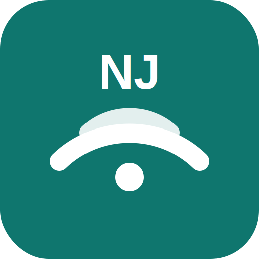

<p align="center">
  
</p>

<h1 align="center">NJUPT-AutoConnect</h1>

<p align="center">
  南京邮电大学校园网手动一键认证工具。
  首次连接填账号、密码、运营商，
  连上 Wi-Fi 后点一下即可联网。
</p>

<p align="center">
  <a href="https://dotrunghuy.github.io/NJUPT-AutoConnect/">
    
  </a>
  
  
  
  
</p>

## 快速使用

| 入口 | 适合设备 | 怎么用 |
| --- | --- | --- |
| [在线 PWA](https://dotrunghuy.github.io/NJUPT-AutoConnect/) | 手机、平板、电脑 | 打开页面填信息|
| `web/index.html` | 离线/本地测试 | 下载仓库后直接打开本地页面 |
| `scripts/windows/connect.cmd` | Windows 电脑 | 双击脚本，首次配置后再次双击即可连接 |

## 日常路径

1. 连接 `NJUPT`、`NJUPT-CMCC` 或 `NJUPT-CHINANET`。
2. 打开 NJUPT-AutoConnect。
3. 点击 **连接校园网**。

首次使用时需要填写账号、密码和运营商。保存后，页面会收起表单，只保留连接按钮和修改/清除入口。

## 添加到主屏幕

手机上建议先打开一次 [在线 PWA](https://dotrunghuy.github.io/NJUPT-AutoConnect/)，然后添加到主屏幕：

| 平台 | 操作 |
| --- | --- |
| iPhone / iPad | Safari 打开页面，分享，添加到主屏幕 |
| Android | Chrome 打开页面，菜单，添加到主屏幕 |
| Windows / macOS | 浏览器收藏页面，或安装为应用 |

提前打开过一次后，页面会被浏览器缓存。即使校园网还没认证，也能打开工具界面。

## 运营商选择

| 选项 | 后缀 | 说明 |
| --- | --- | --- |
| 教育网 | 空 | `njupt` |
| 电信 | `@njxy` | 默认推荐先试这个 |
| 移动 | `@cmcc` | 移动校园网账号 |

## 隐私与安全

- 项目没有服务器，不上传账号或密码。
- PWA 的“记住密码”只写入当前浏览器本地存储，适合个人设备。
- 不想保存密码时，可以关闭“记住密码”，之后每次只补填密码再点连接。
- Windows 脚本使用当前 Windows 用户的 DPAPI 加密保存密码。
- 如果已经可以正常上网，不要反复点击连接，避免校园网 Portal 重复登录。

## 备用方案

如果页面的一键请求被浏览器、证书或校园网策略拦住，页面会显示 **打开登录链接**。点开备用链接后，浏览器会直接访问南邮 Portal 登录地址。

Windows 用户也可以使用脚本版：

```text
scripts/windows/connect.cmd
```

脚本版不创建任务计划、不后台运行、不自启动，只做主动双击一键联网。

## 项目结构

```text
web/
  index.html                 主页面
  sw.js                      离线缓存
  manifest.webmanifest       添加到主屏幕
  icon.svg                   项目图标

scripts/windows/
  connect.cmd                双击入口
  connect.ps1                DPAPI 脚本

docs/
  architecture.md            架构说明
  research.md                接口调研
```

## 说明

NJUPT-AutoConnect 只自动化用户自己的校园网网页登录流程，不提供账号共享、远程代登、代理服务或绕过校园网规则的能力。
